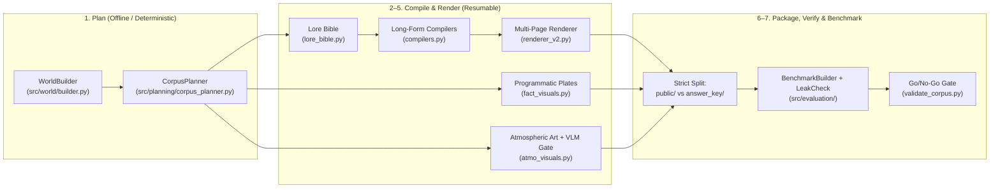

# SyntheticLore-Bench

**A Graph-First, Constraint-Verified Synthetic Corpus & Benchmark Generator for Evaluating Multimodal, Multi-Hop, and Agentic RAG Systems.**

SyntheticLore-Bench generates sprawling, internally consistent fictional franchise universes (~1,300+ pages / 500,000+ words across novel volumes, encyclopedia wikis, technical codexes, and unreliable-narrator ephemera) paired with a mathematically verified ground-truth Q&A benchmark.

---

## Why SyntheticLore-Bench?

Most synthetic RAG benchmarks suffer from three methodology flaws that silently invalidate their evaluation tracks:

1. **The Ego-Graph Multi-Hop Collapse:** Naive graph-to-text generators dump a focal entity's $k$-hop neighborhood into a single document. Retrieving the bridge entity's article answers a "2-hop" question in a single lookup.
2. **Diffusion Number Hallucination:** Asking an image generation model to render numerical charts produces garbled digits, making quantitative visual-RAG questions ungradable.
3. **Unweighted Contradictions:** Injecting conflicting claims into equivalent documents forces RAG agents to guess rather than reason over source authority.

**SyntheticLore-Bench solves all three by construction:**

| Track | Capability Tested | Hard Invariant Enforced by Planner & Verifier |
| :--- | :--- | :--- |
| **Track 1A: Multimodal RAG** | Reading quantitative charts & visual attributes | **Split Visual Engine:** Quantitative facts (`visual_only`) are scrubbed from all text prompts and rendered exclusively on pixel-exact `matplotlib` plates (`fact_visuals.py`). Atmospheric art (`gpt-image-2`) embeds controlled visual details verified via a VLM `YES/NO` gate (`atmo_visuals.py`). |
| **Track 1B: Multi-Hop Reasoning** | Connecting facts across distinct documents | **Non-Cohabitation Constraint:** For every protected 2-hop chain $(A \xrightarrow{e_1} B \xrightarrow{e_2} C)$, the planner guarantees $\text{docs}(e_1) \cap \text{docs}(e_2) = \emptyset$. Post-compilation leak detection (`leakcheck.py`) verifies the LLM never leaked $C$ into $e_1$'s document. |
| **Track 1C: Agentic Conflict Resolution** | Weighing source authority across conflicting claims | **3-Tier Authority Hierarchy:** Ground truth lives *only* in **Tier-1 Canon** (Codex / Royal Annals), planted falsehoods live *only* in **Tier-3 Ephemera** (biased letters, tavern rumors, diaries), and **Tier-2 Wiki** articles flag the dispute without revealing the number. |

---

## Architecture & 7-Stage Pipeline



### Pipeline Stages (`scripts/generate_competition_corpus.py`)

Every stage caches intermediate artifacts on disk and can be resumed or re-run independently:

1. **`plan`** — Builds the directed multigraph world (`WorldBuilder`: factions, characters, locations, historical conflicts, artifacts, creatures, temporal sanity checks, and explicit disputes) and computes the constraint-checked fact-placement matrix (`CorpusPlanner`).
2. **`bible`** — Generates canonical entity voice/style dossiers (`lore_bible.py`) so characters and places maintain consistent characterization across hundreds of pages.
3. **`text`** — Compiles 4 distinct document archetypes strictly from their assigned fact lists (`compilers.py`), followed by an automated verification and repair pass:
   - **The Chronicles (`tier=2`)**: Multi-scene novel chapters with narrative continuity.
   - **The Lore Wiki (`tier=2`)**: Cross-linked encyclopedia articles with Markdown infoboxes.
   - **The Technical Codex (`tier=1`, Canon)**: Clinical archival tables, annals, and logistics ledgers.
   - **Ephemera (`tier=3`, Unreliable)**: In-world letters, diaries, and intercepted dispatches carrying biased perspectives and false claims.
4. **`figures`** — Renders multi-panel archival data plates (`fact_visuals.py`) for Track 1A visual-only facts.
5. **`images`** — Generates portraits, heraldry, relic illustrations, and battle paintings via `gpt-image-2` (`atmo_visuals.py`), verifying controlled visual attributes with a Vision LLM.
6. **`package`** — Paginates documents into multi-page `.pdf`, `.docx`, `.scan.pdf` (simulated aged/rotated archival scans), and `.md` (`renderer_v2.py`), strictly separating participant-facing files (`public/`) from judge-only files (`answer_key/`).
7. **`benchmark`** — Derives Track 1A, 1B, and 1C questions from the protected structures, verifies every item against the compiled corpus text (`leakcheck.py`), and splits into `benchmark_dev.json` (`public/sample_questions.json`) and held-out `benchmark_eval.json`.

---

## Repository Structure

```text
synthlore/
├── src/
│   ├── world/                  # Phase 7 deterministic world graph & naming engine
│   │   ├── builder.py          # WorldBuilder (entities, timelines, temporal sanity, disputes)
│   │   └── naming.py           # Deterministic naming banks & slug utilities
│   ├── planning/               # Phase 7 fact-placement constraint solver
│   │   └── corpus_planner.py   # CorpusPlanner (1A/1B/1C placement & invariant validation)
│   ├── generation/             # LLM compilation, visual plates, and multi-page rendering
│   │   ├── llm_client.py       # Unified Azure AI Foundry async client with preflight & vision
│   │   ├── lore_bible.py       # Canonical entity dossier generator
│   │   ├── compilers.py        # Chronicle, Wiki, Codex, and Ephemera compilers + verifier
│   │   ├── fact_visuals.py     # Programmatic matplotlib chart/plate renderer (Track 1A)
│   │   ├── atmo_visuals.py     # Generative art (gpt-image-2) + VLM attribute verification
│   │   ├── renderer_v2.py      # Paginating PDF, simulated-scan PDF, and DOCX renderer
│   │   ├── document_compiler.py# Legacy Phase 2–6 ego-graph compiler (kept for reference)
│   │   └── visual_renderer.py  # Legacy Phase 3 single-canvas renderer (kept for reference)
│   ├── evaluation/             # Benchmark synthesis & post-generation leak detection
│   │   ├── benchmark.py        # Verified Track 1A/1B/1C benchmark builder
│   │   ├── leakcheck.py        # Lexical & numeric fact-leakage detector
│   │   └── qa_generator.py     # Legacy Phase 4 Q&A generator
│   ├── graph/                  # Legacy Phase 1–6 theme-agnostic graph engine
│   └── settings.py             # Pydantic environment configuration
├── scripts/
│   ├── generate_competition_corpus.py  # Main 7-stage competition pipeline orchestrator
│   ├── validate_corpus.py              # Go/No-Go corpus verification gate (Checks A1–V1)
│   ├── build_world_companion.py        # Self-contained HTML World Companion builder
│   ├── visualize_graph.py              # Knowledge graph topology visualizer
│   ├── smoke_test.py                   # Azure AI Foundry endpoint connectivity check
│   └── legacy/                         # Archived Phase 2–6 ego-graph sample scripts
├── share/                      # Pre-built HTML showcases from the Ashen Era run
│   ├── world_companion/        # Organizer World Companion (dossiers, gallery, hidden layer)
│   ├── ashen_era_world_map.html# Interactive knowledge-graph atlas
│   └── corpus_readiness_report.html    # Automated validation & readiness report
├── docs/                       # Architecture Decision Record, Roadmap, and Azure Setup Guide
└── tests/                      # Invariant & unit test suite (pytest)
```

---

## Quick Start

### 1. Installation

```bash
git clone git@github.com:NavinYP/synthlore.git
cd synthlore

python3 -m venv venv
source venv/bin/activate
pip install -r requirements.txt
```

### 2. Configure Environment (`.env`)

Copy `.env.example` to `.env` and add your Azure AI Foundry / Azure OpenAI credentials (note: the `plan` and `figures` stages and the entire unit test suite run 100% offline without API keys):

```bash
cp .env.example .env
```

### 3. Run the Invariant Test Suite

Verify that world generation, temporal sanity, fact-placement constraints, figure rendering, and multi-page PDF/DOCX pagination hold:

```bash
PYTHONPATH=. pytest tests/ -v
```

### 4. Generate a Corpus

```bash
# Small pilot run (skips gpt-image-2 stage for fast iteration):
PYTHONPATH=. python scripts/generate_competition_corpus.py \
  --stages all --volumes 2 --chapters 4 --ephemera 30 --skip_images

# Full competition run (~415 documents, ~510,000 words, resumable):
PYTHONPATH=. python scripts/generate_competition_corpus.py --stages all

# Resume an existing run from specific stages:
PYTHONPATH=. python scripts/generate_competition_corpus.py \
  --run_dir output/competition_<timestamp> --stages package,benchmark
```

### 5. Run the Go/No-Go Validation Gate

Independently audit a generated corpus directory against all 10 benchmark validity checks (`A1–A3`, `B1–B2`, `C1–C2`, `Q1`, `E1`, `V1`):

```bash
PYTHONPATH=. python scripts/validate_corpus.py --run_dir output/competition_<timestamp>
```

---

## Documentation & Live Showcases

- **[Architecture Decision Record (ADR)](docs/architecture_decision_record.md)** — Technical rationale across Phases 1–7, including the shift from ego-graph dumps to fact placement.
- **[Generation Roadmap](docs/generation_roadmap.md)** — Phase-by-phase evolution of the pipeline.
- **[Azure AI Foundry Setup Guide](docs/azure_setup_guide.md)** — Configuring model deployments (`o3`, `gpt-5.6-luna`, `gpt-5.6-sol`, `gpt-image-2`).
- **Pre-built HTML Showcases (`share/`)**:
  - `share/world_companion/ashen_era_companion.html` — Full organizer companion featuring faction dossiers, conflict timelines, character portraits, and the judge-only dispute layer.
  - `share/ashen_era_world_map.html` — Interactive knowledge-graph explorer.
  - `share/corpus_readiness_report.html` — Visual validation report from the official competition run.

## License

This project is licensed under the [MIT License](LICENSE).
