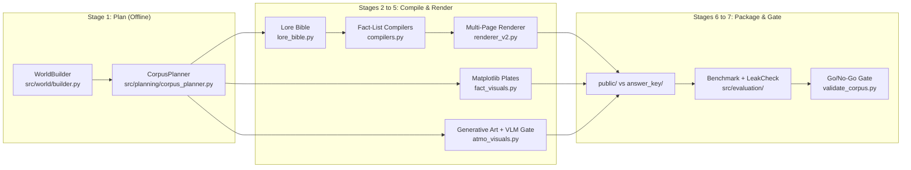
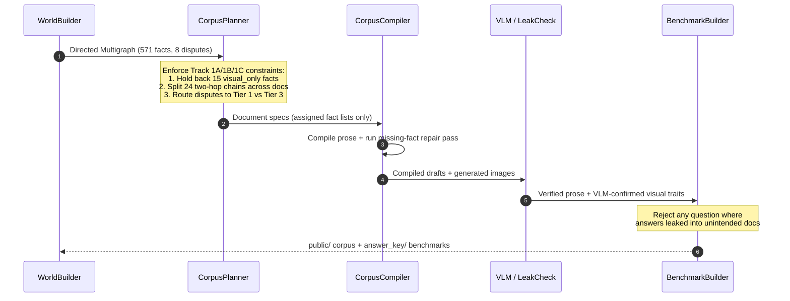

# SyntheticLore-Bench

**A Graph-First, Constraint-Verified Synthetic Corpus and Benchmark Generator for Multimodal, Multi-Hop, and Agentic RAG Evaluation.**

SyntheticLore-Bench generates internally consistent fictional universes (415+ documents, ~511,000 words, ~1,277 pages across novel volumes, encyclopedia wikis, archival codexes, and in-world ephemera) paired with a mathematically verified ground-truth Q&A benchmark.

---

## Core Problem and Solution

Synthetic RAG benchmarks typically fail in three ways:

1. **Ego-Graph Multi-Hop Collapse:** Standard graph-to-text pipelines dump a focal entity's $k$-hop neighborhood into one document. Retrieving the bridge entity's page answers a 2-hop query in a single lookup.
2. **Diffusion Digit Hallucination:** Image generation models garble numbers on charts, making quantitative visual-RAG questions unreliable.
3. **Unweighted Contradictions:** Placing conflicting claims in documents of equal standing forces RAG agents to guess rather than evaluate source authority.

SyntheticLore-Bench prevents all three failure modes at the planning layer before prose generation begins, and verifies the compiled output before packaging:

| Evaluation Track | Target Capability | Enforced Invariant |
| :--- | :--- | :--- |
| **Track 1A: Multimodal** | Reading charts and visual traits | Quantitative facts (`visual_only`) are excluded from all text prompts and plotted via `matplotlib` (`fact_visuals.py`). Generative images (`gpt-image-2`) carry visual attributes verified by a Vision LLM `YES/NO` gate (`atmo_visuals.py`). |
| **Track 1B: Multi-Hop** | Chaining facts across documents | For every protected 2-hop chain $(A \xrightarrow{e_1} B \xrightarrow{e_2} C)$, the planner enforces $\text{docs}(e_1) \cap \text{docs}(e_2) = \emptyset$. Post-compilation leak checks (`leakcheck.py`) confirm $C$ never appears in $e_1$'s documents. |
| **Track 1C: Agentic** | Resolving source conflicts | Ground truth is placed only in **Tier-1 Canon** (Codex / Annals), false claims are planted in **Tier-3 Ephemera** (letters / rumors), and **Tier-2 Wiki** pages note the dispute without stating a value. |

---

## Interactive Architecture Diagrams

### 1. End-to-End 7-Stage Pipeline



### 2. Fact-Placement and Verification Sequence



---

## Concrete Evidence from the Reference Run

Expand the sections below to inspect actual planning structures, verified benchmark items, and validation output from the 415-document *Ashen Era* reference run (`571` atomic facts, `~511,025` words, `~1,277` pages).

<details>
<summary><strong>1. Track 1B Evidence: Protected 2-Hop Chain Placement (<code>plan.json</code>)</strong></summary>

In standard ego-graph pipelines, the Wiki page for `The Thrice-Bound Lantern` (the bridge node) would include both who wields it and where it was forged. Here, `CorpusPlanner` withholds `edge1` from the bridge artifact's Wiki and Codex pages so the two hops never co-occur:

```json
{
  "chain_id": "chain_037",
  "a": "character_halvard_vane_the_grave_sworn",
  "bridge": "artifact_the_thrice_bound_lantern",
  "c": "location_stormmarch",
  "edge1": "edge:character_halvard_vane_the_grave_sworn:WIELDS:artifact_the_thrice_bound_lantern:0",
  "edge2": "edge:artifact_the_thrice_bound_lantern:FORGED_AT:location_stormmarch:0",
  "template": "WIELDS+FORGED_AT",
  "docs_edge1": [
    "codex_reg_character_halvard_vane_the_grave_sworn",
    "wiki_character_halvard_vane_the_grave_sworn"
  ],
  "docs_edge2": [
    "chronicle_v2_c06",
    "codex_arm_artifact_the_thrice_bound_lantern",
    "wiki_artifact_the_thrice_bound_lantern"
  ]
}
```
</details>

<details>
<summary><strong>2. Track 1C Evidence: Authority-Tiered Dispute (<code>plan.json</code> &amp; <code>benchmark_dev.json</code>)</strong></summary>

The true founding year (`246 AS`) is assigned exclusively to a Tier-1 canonical gazetteer (`codex_gaz_location_gloamreach`), while the false claim (`286 AS`) is planted in Tier-3 ephemera:

```json
{
  "dispute_id": "dispute_location_gloamreach_founded",
  "entity": "location_gloamreach",
  "entity_name": "Gloamreach",
  "property": "founded",
  "true_value": 246,
  "false_value": 286,
  "spreader": "a discredited chronicler",
  "false_claim": "According to the enemy's court records, Gloamreach was founded in 286 AS.",
  "canon_doc": "codex_gaz_location_gloamreach",
  "false_docs": [
    "ephemera_045",
    "ephemera_012"
  ]
}
```
</details>

<details>
<summary><strong>3. Track 1A Evidence: Vision-Verified Attribute Question (<code>benchmark_dev.json</code>)</strong></summary>

```json
{
  "qid": "1a_v12",
  "track": "1A_multimodal",
  "subtype": "visual_attribute",
  "question": "What is the central emblem on the banner of House Morvain?",
  "answer": "crossed keys",
  "answer_note": "The image atmo_heraldry_faction_house_morvain.png was generated with, and vision-verified to contain, the central emblem of the banner is a crossed keys. The detail exists only in the image.",
  "expected_evidence": [
    "wiki/house_morvain.md",
    "wiki/images/atmo_heraldry_faction_house_morvain.png"
  ],
  "verified": true
}
```
</details>

<details>
<summary><strong>4. Full 10-Point Go/No-Go Validation Gate Output (<code>validate_corpus.py</code>)</strong></summary>

```text
======================================================================
CORPUS VALIDATION
======================================================================
[PASS] A1 visual-only isolation: 15 values isolated
[PASS] A2 figure plates present: 15 plates ok
[PASS] B1 chain hops never co-located: 24 chains split
[PASS] B2 both hops expressed in text: all hops present
[PASS] C1 false claims planted: 8 disputes planted
[PASS] C2 true value only in canon doc: no stray truths
[PASS] A3 visual attributes isolated: 23 shipped visual questions isolated (26 attributes verified)
[PASS] Q1 benchmark coverage: dev=20 eval=50 rejected=3 tracks={'1A_multimodal': 38, '1B_multihop': 24, '1C_agentic': 8}
[PASS] E1 evidence files exist: 70 questions' evidence resolved
[PASS] V1 fact-miss rate: 7/415 docs with misses
======================================================================
Corpus: 415 documents, ~511,025 words (~1,277 pages)
VERDICT: GO - corpus is benchmark-valid
```
</details>

---

## Repository Layout

```text
synthlore/
├── src/
│   ├── world/                  # Deterministic world graph & naming engine
│   │   ├── builder.py          # WorldBuilder (entities, timelines, temporal sanity, disputes)
│   │   └── naming.py           # Naming banks and slug utilities
│   ├── planning/               # Constraint-satisfaction fact placement
│   │   └── corpus_planner.py   # CorpusPlanner (1A/1B/1C placement & invariant validation)
│   ├── generation/             # LLM compilation, visual plates, and multi-page rendering
│   │   ├── llm_client.py       # Async Azure AI Foundry client with preflight & vision gate
│   │   ├── lore_bible.py       # Canonical entity voice dossier generator
│   │   ├── compilers.py        # Chronicle, Wiki, Codex, and Ephemera compilers + repair loop
│   │   ├── fact_visuals.py     # Programmatic matplotlib chart/plate renderer (Track 1A)
│   │   ├── atmo_visuals.py     # Generative art (gpt-image-2) + VLM verification
│   │   ├── renderer_v2.py      # Paginating PDF, simulated-scan PDF, and DOCX renderer
│   │   ├── document_compiler.py# Legacy Phase 2-6 ego-graph compiler
│   │   └── visual_renderer.py  # Legacy Phase 3 single-canvas renderer
│   ├── evaluation/             # Benchmark synthesis & post-generation leak detection
│   │   ├── benchmark.py        # Verified Track 1A/1B/1C benchmark builder
│   │   ├── leakcheck.py        # Lexical and numeric fact-leakage detector
│   │   └── qa_generator.py     # Legacy Phase 4 Q&A generator
│   ├── graph/                  # Legacy Phase 1-6 theme-agnostic graph engine
│   └── settings.py             # Pydantic environment configuration
├── scripts/
│   ├── generate_competition_corpus.py  # 7-stage resumable corpus pipeline orchestrator
│   ├── validate_corpus.py              # Go/No-Go corpus verification gate (Checks A1-V1)
│   ├── build_world_companion.py        # Self-contained HTML World Companion builder
│   ├── visualize_graph.py              # Knowledge graph topology visualizer
│   ├── smoke_test.py                   # Endpoint connectivity check
│   └── legacy/                         # Archived Phase 2-6 ego-graph scripts
├── share/                      # Pre-built HTML showcases from the Ashen Era run
│   ├── world_companion/        # Organizer World Companion (dossiers, gallery, hidden layer)
│   ├── ashen_era_world_map.html# Interactive knowledge-graph atlas
│   └── corpus_readiness_report.html    # Automated validation report
├── docs/                       # Architecture Decision Record, Roadmap, and Setup Guide
└── tests/                      # Invariant & unit test suite (20 pytest tests)
```

---

## Quick Start

### 1. Install Dependencies

```bash
git clone git@github.com:NavinYP/synthlore.git
cd synthlore

python3 -m venv venv
source venv/bin/activate
pip install -r requirements.txt
```

### 2. Configure Credentials (`.env`)

Copy `.env.example` to `.env` and populate your Azure AI Foundry / Azure OpenAI endpoints. The `plan` and `figures` stages as well as the entire `pytest` suite run offline without API keys.

```bash
cp .env.example .env
```

### 3. Run the Invariant Test Suite

```bash
PYTHONPATH=. pytest tests/ -v
```

### 4. Generate and Validate a Corpus

```bash
# Small pilot run (skips image generation for rapid testing):
PYTHONPATH=. python scripts/generate_competition_corpus.py \
  --stages all --volumes 2 --chapters 4 --ephemera 30 --skip_images

# Full run (~415 documents, resumable across stages):
PYTHONPATH=. python scripts/generate_competition_corpus.py --stages all

# Run the 10-point Go/No-Go verification gate:
PYTHONPATH=. python scripts/validate_corpus.py --run_dir output/competition_<timestamp>
```

---

## What's Next: Generalizing Constraint-Verified Synthesis

While SyntheticLore-Bench uses a dark fantasy setting to guarantee zero pre-training contamination, the underlying **Graph -> Fact-Placement Matrix -> Verified Compilation** pattern is domain-agnostic. Future work focuses on four areas:

1. **Declarative Domain Ontologies:** Replacing the hardcoded entity schemas in `src/world/builder.py` with pluggable YAML/JSON ontology definitions so the same constraint planner can synthesize benchmarks for enterprise legal discovery, clinical EHR timelines, financial audit trails, and incident postmortems.
2. **Arbitrary $k$-Hop and DAG Reasoning Topologies:** Generalizing the 2-hop non-cohabitation solver in `CorpusPlanner` to enforce minimal document-cut constraints over $k$-hop chains, diamond dependency graphs, and temporal aggregation queries.
3. **Open-Weights and Local Model Providers:** Abstracting `UnifiedAIClient` to support `vLLM`, `Ollama`, Anthropic, and Gemini endpoints alongside Azure AI Foundry for local benchmark generation.
4. **Built-In RAG Evaluation Harness:** Adding an automated scoring runner that ingests a target RAG system's predictions and computes hop-level retrieval recall, visual extraction accuracy, and authority-tier resolution scores directly against `answer_key/`.

---

## Documentation and Interactive Showcases

- [Architecture Decision Record (ADR)](docs/architecture_decision_record.md)
- [Generation Roadmap](docs/generation_roadmap.md)
- [Azure AI Foundry Setup Guide](docs/azure_setup_guide.md)
- **Interactive HTML Showcases (`share/`)**:
  - [`share/world_companion/ashen_era_companion.html`](share/world_companion/ashen_era_companion.html): Full organizer companion with faction dossiers, conflict timelines, character portraits, and dispute layers.
  - [`share/ashen_era_world_map.html`](share/ashen_era_world_map.html): Interactive knowledge-graph explorer.
  - [`share/corpus_readiness_report.html`](share/corpus_readiness_report.html): Visual validation report.

## License

Released under the [MIT License](LICENSE).
